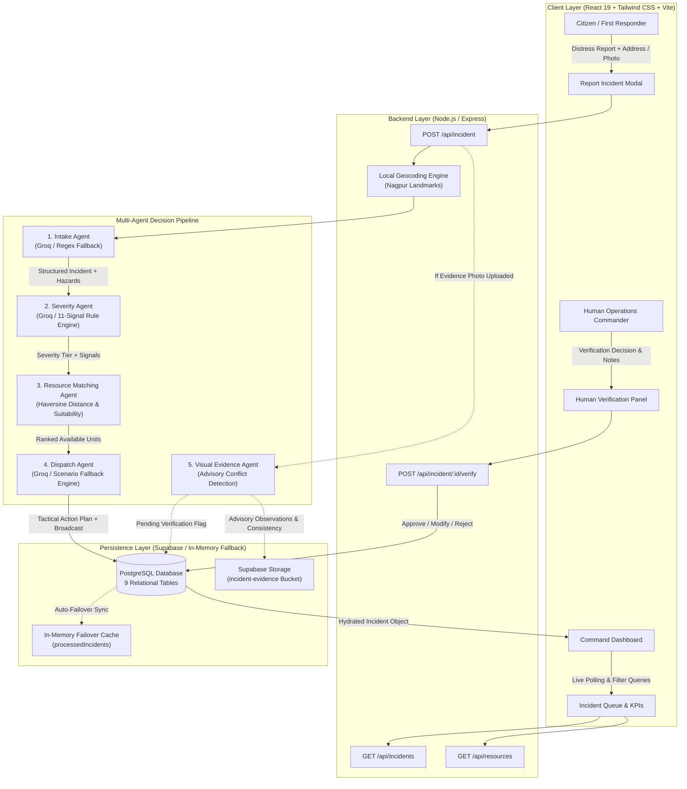
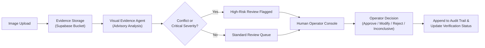
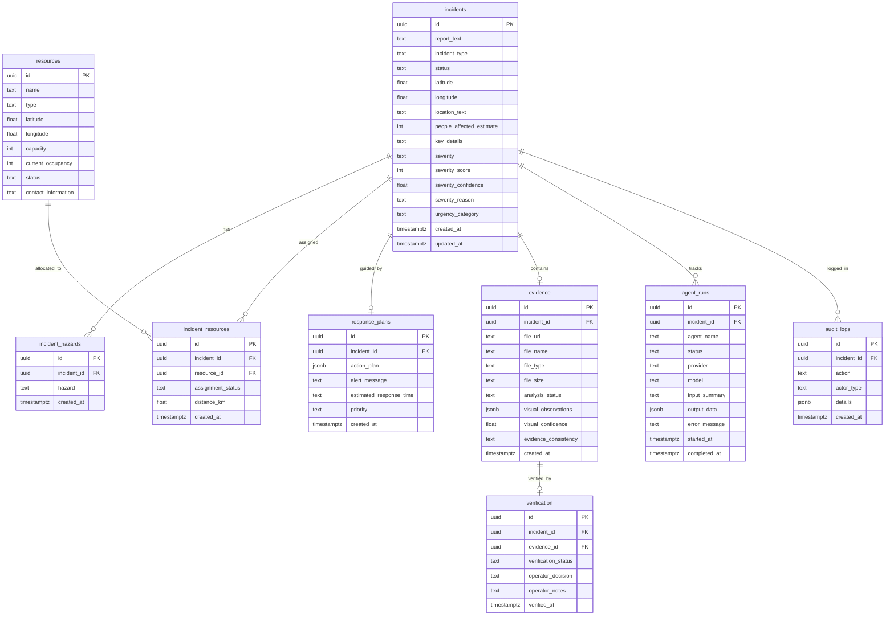

# Disaster Response Coordinator

An AI-powered multi-agent emergency response decision-support system that processes unstructured disaster reports, assesses triage severity, matches regional emergency resources using geographic proximity, synthesizes actionable dispatch plans, and integrates human-in-the-loop visual evidence verification with end-to-end database persistence and audit logging.

[](https://nodejs.org/)
[](https://react.dev/)
[](https://vitejs.dev/)
[](https://expressjs.com/)
[](https://supabase.com/)
[](https://groq.com/)
[](https://tailwindcss.com/)

---

## 1. Overview

During natural disasters and urban emergencies—such as structural building collapses, flash floods, industrial fires, and major transit collisions—emergency coordination centers are overwhelmed by high volumes of incoming distress reports from citizens and emergency personnel. These reports arrive in fragmented, unstructured natural language across phone calls, field radios, web forms, and mobile channels.

Manual triage under crisis conditions introduces critical operational bottlenecks:
* **Information Overload:** Dispatch operators must rapidly decipher ambiguous descriptions, estimate casualties, and identify concealed hazards under extreme time pressure.
* **Resource Misallocation:** First-response units (heavy rescue squads, trauma centers, relief shelters) are frequently dispatched without accurate proximity calculation or need-type alignment.
* **Single Point of Failure in Pure AI:** Relying exclusively on generative artificial intelligence in life-critical environments is dangerous due to cloud API rate limits (HTTP 429), latency spikes, network drops, and potential hallucination.

The **Disaster Response Coordinator** solves these challenges by combining **specialized AI agents** with **deterministic rule engines** and a **human-in-the-loop verification protocol**:
1. **Multi-Agent Decomposition:** The emergency triage workflow is divided into discrete, specialized agents: [Intake Agent](file:///d:/AI%20Project/agents/intakeAgent.js), [Severity Agent](file:///d:/AI%20Project/agents/severityAgent.js), [Resource Matching Agent](file:///d:/AI%20Project/agents/resourceAgent.js), [Dispatch Agent](file:///d:/AI%20Project/agents/dispatchAgent.js), and [Visual Evidence Agent](file:///d:/AI%20Project/agents/visualEvidenceAgent.js).
2. **Hybrid Intelligence (AI + Deterministic Guardrails):** Cloud LLMs (Groq / Gemini) provide semantic understanding and natural-language structuring. If an external API is rate-limited, timed out, or unconfigured, the system immediately fails over to built-in deterministic regular-expression engines and rule heuristics with zero service interruption.
3. **Geographic Resource Prioritization:** Units are matched and ranked using the mathematical Haversine great-circle distance formula against verified coordinates.
4. **Mandatory Human Verification for Visual Evidence:** Photographic evidence is analyzed as advisory decision support. Critical dispatch decisions and evidence confirmation remain strictly under the authority of a qualified human operations commander.
5. **Relational Persistence & Auditability:** Every stage of analysis, resource assignment, and operator intervention is permanently recorded in a Supabase PostgreSQL database across 9 relational tables and an immutable audit log.

---

## 2. Problem Statement

In emergency management, time-to-decision directly impacts human survival. Emergency dispatch teams face a recurring set of operational hurdles:

```text
Incoming Citizen Distress Report (Unstructured / Incomplete / Emotional)
                       │
                       ▼
┌─────────────────────────────────────────────────────────────┐
│                   Critical Dispatch Questions               │
├──────────────────────────────┬──────────────────────────────┤
│ 1. What happened?            │ Incident classification      │
│ 2. How severe is it?         │ Life-threat triage level     │
│ 3. Who needs help?           │ Casualty & affected counts   │
│ 4. What resources are needed?│ Specialized capability specs │
│ 5. Which units are nearest?  │ Proximity & occupancy checks │
│ 6. What tactical actions?    │ Step-by-step response plans  │
└──────────────────────────────┴──────────────────────────────┘
                       │
                       ▼
Delayed / Inconsistent Response (Risk to Human Life & Property)
```

### Specific Deficiencies in Existing Workflows
* **Unstructured Information:** Reports such as *"Building collapsed near MG Road after heavy rain, at least 6 people trapped, one visibly injured"* contain incident type, casualties, location references, entrapment status, and weather triggers in a single unformatted sentence.
* **Ambiguity and Negations:** Critical distinctions such as *"no one trapped"* vs. *"people trapped"* are easily misread under fatigue or misinterpreted by simple keyword search.
* **Manual Spatial Correlation:** Operators often lack instant calculation of which operational shelter, trauma center, or search-and-rescue team is closest and has available capacity.
* **Lack of Visual Validation:** Crowdsourced images may be blurry, outdated, or deliberately misleading. Automated systems that blindly trigger emergency escalations from unverified media risk dangerous false alarms.

The Disaster Response Coordinator resolves this entire workflow by transforming unstructured text into structured operational data in sub-second timeframes, proposing ranked resources and tactical plans, and providing human commanders with clear, auditable control.

---

## 3. Key Features

The following capabilities are fully implemented and verified in the codebase:

* **AI-Powered Incident Understanding:** Automatically extracts incident type, affected population estimates, landmarks, key details, and hazard arrays from freeform text using Groq (`openai/gpt-oss-120b`) or Google Gemini (`gemini-1.5-flash`).
* **Multi-Agent Sequential Pipeline:** Independent agent modules for intake extraction, severity categorization, resource selection, operational dispatch generation, and visual evidence analysis.
* **Deterministic Severity & Signal Engine:** 11 dual-regex signal patterns with built-in negation handling (e.g., distinguishing *"people trapped"* from *"nobody is trapped"* or *"no injuries"*).
* **Instant Rule-Based Fallback:** Immediate zero-retry failover to local regex and rule heuristics when external LLMs encounter HTTP 429 quota limits, 5xx server errors, timeouts (15s), or missing API keys.
* **Haversine Geographic Resource Matching:** Ranks emergency shelters, trauma hospitals, and rescue squads using the spherical Haversine formula against coordinate locations, filtering strictly for active availability.
* **Automated Operational Dispatch Planning:** Generates multi-step emergency action plans (immediate life safety, medical triage, perimeter control, utility isolation, secondary monitoring), estimated response times, and public broadcast alerts.
* **Visual Evidence Consistency Analysis:** Evaluates uploaded photos against report text, outputting advisory observations, confidence scores, and consistency flags (`SUPPORTS`, `CONFLICT`, `INCONCLUSIVE`, `PARTIAL`).
* **Conflict Detection & High-Risk Flagging:** Flags reports for mandatory operator review when photographic evidence contradicts the text report (e.g., dry sunny roads reported as active floods).
* **Human-in-the-Loop Verification Console:** Interactive operator review panel to inspect images, review AI observations, record command decisions (`supports_report`, `partially_supports`, `conflicts_with_report`, `unable_to_verify`), log operator notes, and update verification states (`approved`, `modified`, `rejected`, `inconclusive`).
* **Complete Supabase Relational Persistence:** End-to-end CRUD operations on Supabase PostgreSQL across 9 normalized tables with relational foreign keys.
* **Dual-Tier Evidence Storage:** Uploads binary photographic evidence to Supabase Storage bucket `incident-evidence` with transparent fallback to inline DataURL encoding.
* **System Execution Tracking & Audit Logging:** Tracks each agent execution latency, model, status, and I/O payload in `agent_runs`, and appends timestamped system/operator actions in `audit_logs`.
* **Local Regional Geocoding Engine:** Regex-based landmark resolution for the Nagpur operational sector (MG Road, Sitabuldi, Dharampeth, Wardha Road, etc.) without coordinate spoofing.
* **In-Memory Failover Cache:** Automatically synchronizes in-memory incident registers if database connection drops, guaranteeing continuous service.
* **Responsive Emergency Command Dashboard:** Built with React 19, Vite, and Tailwind CSS, featuring operational KPI counters, filterable incident tables, pipeline flow visualizers, and resource directories.

---

## 4. System Architecture

The Disaster Response Coordinator operates as a decoupled client-server application. The frontend communicates with the Express backend via REST endpoints, which orchestrates the multi-agent pipeline and persists all states to Supabase.



### Visual Evidence & Human Verification Flow



> [!IMPORTANT]
> **Advisory Architecture Guarantee:** AI-generated visual observations and consistency tags function strictly as supporting evidence. The Visual Evidence Agent **never** independently modifies incident severity scores, alters resource allocations, or executes dispatch orders without operator validation.

---

## 5. Multi-Agent Architecture

The coordinator organizes triage into five specialized agents with clear boundaries of responsibility, input schemas, and output contracts:

| Agent | Responsibility | Input | Output | Source File |
| :--- | :--- | :--- | :--- | :--- |
| **Intake Agent** | Parses unstructured text into structured emergency data; extracts incident type, casualties, location, and hazards. | Raw report text, optional coordinates `(lat, long)`. | `{ incidentType, peopleAffectedEstimate, location, keyDetails, reportedHazards, lat, long, llmStatus }` | [`agents/intakeAgent.js`](file:///d:/AI%20Project/agents/intakeAgent.js) |
| **Severity Agent** | Triage assessment; calculates severity tier, numerical score, urgency level, confidence, and detected signals. | Structured intake object + raw report text. | `{ severity, severityScore, urgencyCategory, confidence, reason, signals, llmStatus }` | [`agents/severityAgent.js`](file:///d:/AI%20Project/agents/severityAgent.js) |
| **Resource Matching Agent** | Filters available regional resources by incident type and urgency; computes spherical distances and ranks units. | Incident coordinates, incident type, severity score, context hazards. | Array of ranked resource objects with calculated `distanceKm`, capacity, and status. | [`agents/resourceAgent.js`](file:///d:/AI%20Project/agents/resourceAgent.js) |
| **Dispatch Agent** | Synthesizes a structured 5-step operational action plan, broadcast emergency alert, and estimated response time. | Intake object, severity assessment, matched resources. | `{ actionPlan, alertMessage, estimatedResponseTime, priority, llmStatus }` | [`agents/dispatchAgent.js`](file:///d:/AI%20Project/agents/dispatchAgent.js) |
| **Visual Evidence Agent** | Performs advisory visual analysis, scene observation extraction, conflict detection against text, and audit staging. | Uploaded image object, intake object, report text, severity assessment. | `{ image, analysis: { observations, confidence, consistency }, verification: { status }, highRiskFlag, auditTrail }` | [`agents/visualEvidenceAgent.js`](file:///d:/AI%20Project/agents/visualEvidenceAgent.js) |

### Intake Agent Detailed Workflow
Implemented in [`agents/intakeAgent.js`](file:///d:/AI%20Project/agents/intakeAgent.js), the Intake Agent dispatches a structured system prompt to the LLM instructing it to output strict JSON conforming to:
* `incidentType`: Restricted to `structural_collapse`, `flood`, `fire`, `medical`, `road_accident`, or `other`.
* `peopleAffectedEstimate`: Numeric integer count.
* `location`: Extracted landmark or street identifier.
* `keyDetails`: Compact factual synthesis.
* `reportedHazards`: Array of specific hazard identifiers (e.g., `trapped_people`, `heavy_rain`, `injury`, `toxic_smoke`).

If the LLM call fails, the `deterministicIntakeFallback` function parses the text using case-insensitive regular expressions for keywords, digit extraction (`(\d+)\s+people`), number words (`one` through `ten`), and location prepositions (`near`, `at`, `on`, `around`).

### Severity Agent Detailed Workflow
Implemented in [`agents/severityAgent.js`](file:///d:/AI%20Project/agents/severityAgent.js), the agent requests semantic evaluation from Groq/Gemini with confidence scoring. If the LLM is unavailable, it calls `buildFallbackResult`, which executes an 11-signal regex pipeline with negation patterns to produce deterministic scores.

### Resource Matching Agent Detailed Workflow
Implemented in [`agents/resourceAgent.js`](file:///d:/AI%20Project/agents/resourceAgent.js), this agent performs deterministic geographic calculation and rule-based suitability filtering without calling an external LLM, guaranteeing zero latency overhead.

### Dispatch Agent Detailed Workflow
Implemented in [`agents/dispatchAgent.js`](file:///d:/AI%20Project/agents/dispatchAgent.js), this agent prompts the LLM for domain-specific operational steps. If the LLM is unavailable, `buildFallbackDispatchPlan` provides domain-specific emergency actions tailored specifically to structural collapse, flood, fire, transit accident, or general emergency scenarios.

---

## 6. Algorithms and Decision Logic

The architecture cleanly decouples generative artificial intelligence from deterministic logic to prevent single points of failure.

### AI / ML Techniques

* **LLM-Based Natural Language Understanding:** Leverages Groq-hosted open weights (`openai/gpt-oss-120b`) and Google Gemini (`gemini-1.5-flash`) for deep semantic extraction from ambiguous citizen text.
* **Structured Output Constrained Decoding:** Uses JSON mode (`response_format: { type: 'json_object' }`) at `temperature: 0.1` to enforce strict schema adherence and eliminate extraneous conversational chatter.
* **Robust JSON Boundary Parsing:** Implemented in `parseJsonFromText` ([`llm/groqProvider.js`](file:///d:/AI%20Project/llm/groqProvider.js)), the algorithm strips markdown fences (````json ... ````) and performs character substring bounding between the first `{` and last `}` to recover valid JSON even if surrounding text is present.
* **Multi-Agent Sequential Orchestration:** Orchestrates prompt chaining across agents where each downstream agent consumes validated outputs from preceding stages.

### Deterministic Algorithms

#### 1. Haversine Great-Circle Distance Algorithm
* **What it does:** Calculates the shortest distance over the Earth's spherical surface between incident coordinates $(\phi_1, \lambda_1)$ and emergency resource coordinates $(\phi_2, \lambda_2)$.
* **Mathematical Formula:**
  $$\Delta\phi = \phi_2 - \phi_1, \quad \Delta\lambda = \lambda_2 - \lambda_1$$
  $$a = \sin^2\left(\frac{\Delta\phi}{2}\right) + \cos(\phi_1)\cos(\phi_2)\sin^2\left(\frac{\Delta\lambda}{2}\right)$$
  $$c = 2 \cdot \arcsin(\sqrt{a}), \quad d = R \cdot c$$
  Where $R = 6371\text{ km}$ (Earth radius).
* **Where it appears:** [`agents/resourceAgent.js`](file:///d:/AI%20Project/agents/resourceAgent.js#L14-L23).
* **Why it is used:** Provides accurate spatial distance in kilometers without depending on third-party paid routing or mapping APIs.

#### 2. Dual-Regex Signal Extraction Engine with Negation Handling
* **What it does:** Scans text across 11 discrete signal categories. A signal is recorded as active **if and only if** its positive regex matches **and** its paired negation regex does **not** match.
* **Where it appears:** [`agents/severityAgent.js`](file:///d:/AI%20Project/agents/severityAgent.js#L27-L61).
* **Sample Patterns:**
  * Signal `people_trapped`: Matches `/\b(trapped|stranded|stuck|buried|pinned|under the rubble)\b/i`. Negated by `/\b(no\s+one\s+trapped|nobody\s+is\s+trapped|not\s+trapped)\b/i`.
  * Signal `injury_reported`: Matches `/\b(injur\w*|wound\w*|bleeding|fracture\w*|hurt)\b/i`. Negated by `/\b(no\s+injur\w*|nobody\s+hurt|no\s+casualties)\b/i`.
  * Signal `casualties_or_deaths`: Matches `/\b(casualt\w*|fatalit\w*|deaths?|deceased|killed)\b/i`. Negated by `/\b(no\s+casualt\w*|nobody\s+died|no\s+loss\s+of\s+life)\b/i`.
* **Why it is used:** Eliminates catastrophic false escalations in emergency triage caused by naive keyword searching.

#### 3. Deterministic Severity Scoring Rules
* **What it does:** Maps verified signals and affected counts directly to triage tiers.
* **Where it appears:** [`agents/severityAgent.js`](file:///d:/AI%20Project/agents/severityAgent.js#L120-L176).
* **Why it is used:** Guarantees deterministic evaluation when external LLMs are unreachable.

#### 4. Resource Suitability Filtering & Priority Assignment
* **What it does:** Evaluates incident requirements against resource categories:
  * *Structural Collapse:* Nearest `rescue_team` (priority 1) + nearest `hospital` (priority 2) + `shelter` if score $\ge 4$.
  * *Flood:* Nearest `rescue_team` + nearest `shelter` + `hospital` if injuries or score $= 5$.
  * *Fire:* Specialized fire & rescue team + `hospital` if injuries + `shelter` if displacements.
  * *Medical:* Nearest `hospital` + `rescue_team` if trapped.
* **Where it appears:** [`agents/resourceAgent.js`](file:///d:/AI%20Project/agents/resourceAgent.js#L98-L166).

#### 5. Deterministic Landmark Geocoding
* **What it does:** Matches address strings against known landmark patterns for the regional sector (Nagpur).
* **Where it appears:** [`utils/geocoding.js`](file:///d:/AI%20Project/utils/geocoding.js#L6-L125).
* **Safety Feature:** If an address is unresolvable, the engine returns `{ resolved: false, latitude: null, longitude: null }` rather than fabricating coordinates.

---

## 7. Severity Assessment

Emergency triage categorizes incidents into four distinct severity tiers based on human life risk, physical entrapment, structural integrity, and environmental scale:

| Severity Level | Score | Urgency Category | Criteria & Signals Required | Action Expectation |
| :---: | :---: | :---: | :--- | :--- |
| **CRITICAL** | **5** | `critical` | Imminent life-threatening conditions: `people_trapped`, `casualties_or_deaths`, or `building_collapse`. | Immediate high-priority dispatch; simultaneous rescue and trauma hospital activation. |
| **HIGH** | **4** | `high` | Serious emergency without confirmed entrapment: `injury_reported`, `flood` affecting multiple households, `evacuation`, `dangerous_conditions` (gas leak, live wires), or `blocked_roads`. | Priority dispatch of regional units; hospital alert; evacuation shelter staging. |
| **MEDIUM** | **3** | `moderate` | Localized emergency with contained impact: localized `flood`, `fire` without confirmed casualties, localized property damage, or multiple displaced households. | Standard response unit allocation; monitoring for condition deterioration. |
| **LOW** | **2** | `low` | Minor incident, cosmetic damage, or transit fender-bender with no injuries reported (`minor_damage_only`). | Routine patrol or nearest available unit dispatched without escalating specialized teams. |

### Why Deterministic Triage Rules Are Essential
1. **Zero Hallucination Tolerance:** In emergency response, an AI model hallucinating that an incident has "no injuries" when entrapment exists can lead to fatalities.
2. **Resilience During Crises:** Regional disasters trigger massive surges in cloud API traffic, leading to 429 quota exhaustion and network cutoffs. Deterministic rules ensure that triage runs locally and instantly at all times.
3. **Auditable Decision Trails:** Legal and government oversight requires explainable triage decisions based on documented criteria rather than black-box probabilities.

---

## 8. Resource Matching

The resource matching engine connects incident requirements to available regional emergency units:

```text
Incident Requirements (Type, Severity Score, Hazards, Coordinates)
                               │
                               ▼
Curated Regional Resources Directory (shelters.json / Supabase 'resources')
                               │
                               ▼
Filtering Stage: status == 'available' (Excludes 'dispatched' and 'full' units)
                               │
                               ▼
Proximity Calculation: Haversine distance from incident (lat, long) to resource
                               │
                               ▼
Suitability Mapping: Incident type & hazard matching (Rescue / Hospital / Shelter)
                               │
                               ▼
Sorted & Ranked Assigned Units (Stored in Supabase 'incident_resources')
```

### Resource Schema Fields
Each resource record contains:
* `id`: Unique identifier (e.g., `rescue-001`, `hospital-001`, `shelter-001`).
* `name`: Facility or squad title (e.g., *"Nagpur Fire & Rescue Unit 1"*).
* `type`: Categorized as `rescue_team`, `hospital`, or `shelter`.
* `latitude`, `longitude`: Spatial coordinates.
* `capacity`: Total operational capacity (beds, personnel, or evacuee slots).
* `currentOccupancy`: Current active utilization.
* `status`: Current availability (`available`, `dispatched`, `full`).

### Simulation vs. Real-World Dispatch
> [!NOTE]
> The resources in this system represent a **curated regional dataset for the Nagpur administrative zone** (stored in [`data/shelters.json`](file:///d:/AI%20Project/data/shelters.json) and seeded into Supabase). The application simulates unit reservation, distance ranking, and dispatch staging. It does **not** directly interface with live municipal 911/112 Computer-Aided Dispatch (CAD) systems.

---

## 9. Human-in-the-Loop Verification

Visual evidence provides valuable situational awareness, but automated computer vision cannot replace human judgment during life-critical decisions.

```text
[Citizen Upload] ──> [Supabase Storage Bucket: 'incident-evidence']
                               │
                               ▼
              [Visual Evidence Advisory Analysis]
              - Observations List
              - Confidence Score
              - Consistency Flag: SUPPORTS | CONFLICT | INCONCLUSIVE | PARTIAL
                               │
                               ▼
              [High-Risk Verification Flagging]
              - Triggered if Severity == CRITICAL or Consistency == CONFLICT
                               │
                               ▼
              [Human Operator Verification Panel]
              - Visual side-by-side inspection of photo & report text
              - Radio selection of operator decision:
                  * supports_report
                  * partially_supports
                  * conflicts_with_report
                  * unable_to_verify
              - Mandatory operator notes & rationale
                               │
                               ▼
              [Verification Submission: POST /api/incident/:id/verify]
              - Status updated to: approved | modified | rejected | inconclusive
              - Permanent record written to 'verification' table
              - Event appended to 'audit_logs'
```

> "AI-generated visual observations are supporting evidence. Final verification is performed by a human operator."

### Why Human-in-the-Loop is Critical
* **Accountability:** Government emergency protocols require an identified human officer ("Duty Operations Commander") to authorize emergency actions.
* **Adversarial & Mistaken Uploads:** Citizens may mistakenly attach outdated photos, stock imagery, or photos of unrelated clear streets during flood scares. Conflict detection alerts the commander to verify on-scene before committing high-value resources.
* **Contextual Nuance:** Human commanders understand local topography, road construction, and weather developments that raw algorithms cannot perceive.

---

## 10. Validation and Safety

The Disaster Response Coordinator implements defense-in-depth safety mechanisms:

1. **Strict JSON Schema Validation:** Every LLM response is parsed and validated against expected type schemas. Missing fields trigger automatic fallback substitution.
2. **Dual-Regex Negation Protection:** Ensures phrases like *"no casualties"* or *"not trapped"* are never parsed as active casualties or entrapment.
3. **Deterministic Failover on All LLM Errors:** HTTP 429 quota exhaustion, 5xx gateway errors, 15-second timeouts, or unparseable JSON immediately activate local regex fallbacks.
4. **No Coordinate Hallucination:** If an address is unknown to the landmark dictionary, coordinates remain `null`. The system never invents fake geographic coordinates.
5. **Payload Limits & Sanitation:** Express enforces a `10mb` payload limit on incoming base64 image data to prevent denial-of-service memory exhaustion.
6. **Immutable Audit Trail:** All system analyses and operator overrides are permanently recorded in the database with timestamps and actor designations (`system`, `ai_agent`, `operator`).

---

## 11. AI Provider / LLM Architecture

The LLM abstraction layer is centralized in [`llm/index.js`](file:///d:/AI%20Project/llm/index.js), decoupling agents from specific AI vendors:

```text
               Agent Call (Intake, Severity, Dispatch)
                                 │
                                 ▼
                     [Central LLM Router: llm/index.js]
                                 │
                 ┌───────────────┴───────────────┐
                 ▼                               ▼
       [Primary: Groq Cloud]          [Secondary: Google Gemini]
       Model: openai/gpt-oss-120b     Model: gemini-1.5-flash
       Client: groq-sdk               Client: @google/generative-ai
                 │                               │
                 └───────────────┬───────────────┘
                                 │
                    Failure / Rate Limit / Timeout?
                                 │
                                 ▼
              [Immediate Deterministic Fallback Engine]
              - Regex Type Extractor
              - 11-Signal Dual-Regex Engine
              - Scenario-Based Dispatch Synthesizer
```

### Configuration and Providers
* **Primary Provider:** Groq Cloud API using `openai/gpt-oss-120b`.
* **Secondary / Alternative Provider:** Google Gemini API using `gemini-1.5-flash`.
* **Configured via `.env`:** `LLM_PROVIDER=groq` (or `gemini` / `fallback`).

### Clarification on Groq
> [!NOTE]
> **Groq is an ultra-low-latency AI hardware and inference infrastructure provider**, not an AI algorithm. It executes open-weights models (such as `openai/gpt-oss-120b`) via optimized Tensor Streaming Processors (LPU inference engines).

### Error & Retry Policy
* **HTTP 429 (Rate Limit / Quota Exhaustion):** Zero retries. Fails over **immediately** to the deterministic rule engine to conserve quota and prevent triage latency.
* **HTTP 5xx / Network Drops:** Exactly 1 retry after a 500ms backoff before triggering fallback.
* **Timeout:** Maximum 15,000ms race timeout per request.

---

## 12. Database Architecture

The persistence layer uses a **Supabase PostgreSQL** database. If Supabase is unavailable, an in-memory cache maintains operation automatically.

### Entity Relationship Diagram



### Table Dictionary
1. **`incidents`:** Core register of emergency reports, spatial coordinates, triage status, and assigned severity scores.
2. **`incident_hazards`:** Relational entries for specific detected hazards (e.g., `trapped_people`, `heavy_rain`, `structural_collapse`).
3. **`resources`:** Directory of regional shelters, hospitals, and rescue squads with capacity and status.
4. **`incident_resources`:** Many-to-many join table recording assigned resources and computed Haversine distances.
5. **`response_plans`:** Tactical step-by-step operational response plans, priority ratings, and public broadcast messages.
6. **`evidence`:** Metadata and storage URLs for uploaded photographic evidence, along with advisory visual observations and consistency classifications.
7. **`verification`:** Human operator verification decisions, commander notes, and approval status.
8. **`agent_runs`:** Observability ledger tracking agent execution latency, active LLM provider, model version, and I/O data.
9. **`audit_logs`:** Immutable chronological audit log recording every system action, agent completion, and human intervention.
10. **Storage Bucket (`incident-evidence`):** Binary object storage bucket holding uploaded incident photographs.

---

## 13. Data Flow

The end-to-end data lifecycle from citizen report to verified response:

```text
1. Report Submission:
   User submits report text, address (or coordinates), and optional image evidence via UI or API.

2. Geocoding & Coordinate Resolution:
   Backend evaluates address via `utils/geocoding.js`. Coordinates resolved to regional landmark or kept null.

3. Intake Agent Execution:
   Raw text converted to structured object: incidentType, casualties, hazards, location.
   Row created in Supabase `incidents` table and `incident_hazards`. Run logged to `agent_runs`.

4. Severity Agent Execution:
   Consumes intake data. Evaluates life risk via Groq or 11-signal regex engine.
   Computes severity tier (CRITICAL/HIGH/MEDIUM/LOW), score (1-5), and confidence.
   Updates `incidents` row with severity fields. Run logged to `agent_runs`.

5. Resource Matching Agent Execution:
   Consumes incident coordinates and required resource types.
   Computes Haversine distance to available units in `resources` table.
   Selects and ranks nearest units. Writes assignments to `incident_resources`. Run logged to `agent_runs`.

6. Dispatch Agent Execution:
   Consumes intake, severity, and matched units.
   Synthesizes 5-step operational action plan, broadcast alert, and ETA.
   Persists plan in `response_plans` table. Run logged to `agent_runs`.

7. Visual Evidence Advisory Analysis (Conditional):
   If photo provided: Uploads image to Supabase Storage bucket `incident-evidence`.
   Evaluates visual consistency against report text. Records advisory observations.
   Inserts rows into `evidence` and initial `verification` (status: 'pending').

8. Hydration & Response:
   Unified incident object is fetched and hydrated from Supabase and returned as HTTP 201 Created.

9. Human Verification (Optional/Post-Dispatch):
   Operations commander inspects evidence on the dashboard. Submits approval decision.
   Updates `verification` table; appends event to `audit_logs`.
```

---

## 14. Example Walkthrough

The following real-world example matches automated test case `Test 1` from the repository test suite ([`test_pipeline.js`](file:///d:/AI%20Project/test_pipeline.js)):

### Input Distress Report
```text
"Building collapsed near MG Road after heavy rain, at least 6 people trapped, one visibly injured"
Address: "MG Road, Nagpur" (Resolved Coordinates: 21.1458, 79.0882)
Evidence: Photo attached (building_collapse.jpg)
```

### Processed Output

#### 1. Intake Agent Extraction
```json
{
  "incidentType": "structural_collapse",
  "peopleAffectedEstimate": 6,
  "location": "MG Road, Nagpur",
  "keyDetails": "Building collapsed near MG Road after heavy rain, at least 6 people trapped, one visibly injured",
  "reportedHazards": ["structural_collapse", "trapped_people", "injury", "heavy_rain"]
}
```

#### 2. Severity Assessment
```json
{
  "severity": "CRITICAL",
  "severityScore": 5,
  "urgencyCategory": "critical",
  "confidence": 0.95,
  "signals": ["people_trapped", "injury_reported", "building_collapse", "flood"],
  "reason": "Rule-based assessment: imminent life-threatening emergency (people trapped) (structural collapse). Immediate priority response required."
}
```

#### 3. Geographic Resource Allocation (Haversine Proximity)
```text
1. [rescue_team] Nagpur Fire & Rescue Unit 1 ── 0.83 km (Status: available)
2. [hospital]    Mayo General Hospital       ── 1.95 km (Status: available)
3. [shelter]     Dharampeth Community Shelter ── 1.83 km (Status: available)
```

#### 4. Operational Dispatch Response Plan
```json
{
  "priority": "CRITICAL",
  "estimatedResponseTime": "8-12 minutes",
  "alertMessage": "CRITICAL: Structural collapse at MG Road, Nagpur. Search & rescue units deployed. Avoid area and keep access roads clear.",
  "actionPlan": [
    "Step 1: Immediately deploy primary rescue teams (Nagpur Fire & Rescue Unit 1) to MG Road, Nagpur.",
    "Step 2: Establish a strict 100-meter safety perimeter to protect against secondary collapse.",
    "Step 3: Deploy acoustic/optical search and rescue equipment to locate trapped individuals.",
    "Step 4: Notify nearby trauma hospitals (Mayo General Hospital) to prepare for incoming blast/crush injury patients.",
    "Step 5: Isolate local utilities (gas, electrical mains) to eliminate fire and explosion hazards."
  ]
}
```

#### 5. Visual Evidence Advisory Observations
```json
{
  "consistency": "SUPPORTS",
  "confidence": 0.91,
  "observations": [
    "Significant structural fracturing and damaged masonry visible on the structure",
    "Heavy concrete rubble and debris scattered across the immediate foreground",
    "Road access and pedestrian pathways appear partially obstructed by fallen materials",
    "Utility lines or surface cables visibly displaced along the structural perimeter"
  ],
  "highRiskFlag": {
    "required": true,
    "reason": "Critical severity incident: Life-safety protocol requires human verification."
  }
}
```

---

## 15. Technology Stack

| Architectural Layer | Technology | Purpose in Project |
| :--- | :--- | :--- |
| **Frontend Framework** | React 19 (`19.2.8`) | Reactive user interface and state management for the command dashboard. |
| **Frontend Build Tool** | Vite (`8.2.2`) | Ultra-fast development server, asset bundling, and Hot Module Replacement (HMR). |
| **Styling & Design System** | Tailwind CSS (`3.4.19`) + PostCSS | Responsive emergency management UI with color-coded severity badges and status indicators. |
| **UI Iconography** | Lucide React (`1.43.0`) | Specialized iconography for hazards, emergency resources, and triage indicators. |
| **Backend Runtime** | Node.js (v18+ or v20+) | High-performance asynchronous execution runtime. |
| **Backend Framework** | Express (`4.21.2`) | RESTful routing, payload validation, and pipeline coordination. |
| **Primary LLM Provider** | Groq Cloud SDK (`groq-sdk 1.6.0`) | High-speed inference using `openai/gpt-oss-120b`. |
| **Alternative LLM** | Google GenAI (`@google/generative-ai 0.24.1`) | Secondary multimodal/text fallback using `gemini-1.5-flash`. |
| **Relational Database** | Supabase PostgreSQL (`@supabase/supabase-js 2.116.0`) | 9 relational tables tracking incidents, hazards, resources, plans, runs, and audit logs. |
| **Object Storage** | Supabase Storage (`incident-evidence` bucket) | Storage and public URL generation for photographic evidence. |
| **Cross-Origin Handling** | CORS (`cors 2.8.5`) | Cross-origin resource sharing between frontend and backend. |
| **Environment Config** | Dotenv (`dotenv 16.4.5`) | Secure environment variable configuration. |

---

## 16. Project Structure

The repository follows a clean, decoupled architecture:

```text
d:\AI Project/
├── .env.example                     # Template environment variable configuration
├── package.json                     # Backend dependencies and execution scripts
├── server.js                        # Express server entrypoint and Supabase initialization
├── agents/                          # Specialized AI and deterministic triage agents
│   ├── intakeAgent.js               # Structured incident intake parser and regex fallback
│   ├── severityAgent.js             # 11-signal regex engine and LLM severity triage
│   ├── resourceAgent.js             # Haversine distance calculator and resource matcher
│   ├── dispatchAgent.js             # Operational response plan generator and fallback engine
│   ├── visualEvidenceAgent.js       # Advisory visual evidence analysis and conflict detector
│   └── geminiClient.js              # Legacy compatibility wrapper for LLM services
├── data/
│   └── shelters.json                # Regional emergency resources dataset (Nagpur sector)
├── llm/                             # Unified LLM provider abstraction layer
│   ├── index.js                     # Provider selector, structured caller, and error handler
│   ├── groqProvider.js              # Groq SDK client, timeout race, and JSON fence parser
│   └── geminiProvider.js            # Google Generative AI client and timeout race
├── routes/
│   └── incident.js                  # REST endpoints: POST /incident, POST /verify, GET /incidents
├── services/
│   └── supabaseService.js           # Supabase client, table operations, and incident hydration
├── utils/
│   └── geocoding.js                 # Local regex landmark geocoder for Nagpur landmarks
├── test_pipeline.js                 # 4-scenario end-to-end multi-agent verification script
├── test_supabase_pipeline.js        # Supabase database integration test suite
├── test_verification_pipeline.js    # Visual evidence and human verification test script
├── test_form_ux.js                  # Frontend form UX and geocoding test suite
└── frontend/                        # React 19 + Tailwind CSS + Vite web application
    ├── package.json                 # Frontend dependencies (React 19, Lucide, Tailwind)
    ├── vite.config.js               # Vite bundler configuration
    ├── tailwind.config.js           # Tailwind CSS theme configuration
    ├── index.html                   # Single-page application HTML entrypoint
    └── src/
        ├── App.jsx                  # Main dashboard controller and view switcher
        ├── main.jsx                 # React root renderer
        ├── services/
        │   ├── api.js               # Backend API client, mock resources, and demo presets
        │   └── geocoding.js         # Frontend landmark coordinate lookup helper
        └── components/              # Modular UI components
            ├── activity/            # Agent activity timeline and execution metrics
            ├── common/              # Reusable status and severity badges
            ├── dashboard/           # Incident tables and KPI summary bars
            ├── evidence/            # Visual evidence cards, human verification panels, audit logs
            ├── forms/               # Emergency report modal and evidence upload widgets
            ├── incidents/           # Incident detail drawers, agent pipeline flows, severity gauges
            ├── layout/              # Header, navigation bars, and mobile sidebar
            ├── resources/           # Regional emergency resource directory views
            └── response/            # Response plan action cards and alert previewers
```

---

## 17. API Endpoints

The backend provides clean, RESTful endpoints under the `/api` prefix:

| Method | Endpoint | Purpose | Request Payload | Response Format |
| :--- | :--- | :--- | :--- | :--- |
| **`GET`** | `/` | Service health check, LLM provider status, and configuration check. | *None* | `{ status: "ok", llmProvider, groqConfigured, geminiConfigured }` |
| **`POST`** | `/api/incident` | Submits report, runs multi-agent pipeline, and persists all records to Supabase. | `{ reportText, address?, latitude?, longitude?, evidenceImage? }` | Full hydrated incident object (`201 Created`) with intake, severity, resources, dispatch, evidence. |
| **`POST`** | `/api/incident/:id/verify` | Submits human operator verification decision, updates verification table, and logs audit. | `{ verificationStatus, operatorDecision, operatorNotes }` | Updated hydrated incident object (`200 OK`). |
| **`GET`** | `/api/incidents` | Lists all processed incidents from Supabase, sorted by creation date descending. | *None* | Array of hydrated incident objects (`200 OK`). |
| **`GET`** | `/api/resources` | Lists all regional emergency resources (shelters, hospitals, rescue teams). | *None* | Array of resource objects (`200 OK`). |

---

## 18. Installation & Setup

Follow these exact steps to run the complete Disaster Response Coordinator locally.

### Prerequisites
* **Node.js:** v18.0.0 or v20+ installed ([nodejs.org](https://nodejs.org/)).
* **npm:** Node Package Manager (comes with Node.js).
* **Supabase Project:** (Free tier or local) for PostgreSQL database and Storage.
* **Groq API Key:** (Free tier available at [console.groq.com](https://console.groq.com)) for ultra-fast LLM inference.
* *(Optional)* **Google Gemini API Key:** (From [aistudio.google.com](https://aistudio.google.com)) if using Gemini as alternative LLM.

### 1. Clone the Repository
```bash
git clone https://github.com/your-username/disaster-response-coordinator.git
cd disaster-response-coordinator
```

### 2. Backend Setup & Configuration
Install backend dependencies:
```bash
npm install
```

Create a `.env` file in the project root:
```env
# Primary LLM Provider: 'groq' | 'gemini' | 'fallback'
LLM_PROVIDER=groq

# Groq API Configuration
GROQ_API_KEY=your_groq_api_key_here
GROQ_MODEL=openai/gpt-oss-120b

# Optional: Gemini API Configuration
GEMINI_API_KEY=your_gemini_api_key_here

# Server Port (defaults to 3000)
PORT=3000

# Supabase PostgreSQL Configuration
SUPABASE_URL=https://your-project-id.supabase.co
SUPABASE_ANON_KEY=your_supabase_anon_key_here
SUPABASE_SERVICE_ROLE_KEY=your_supabase_service_role_key_here
```

> [!CAUTION]
> **Security Notice:** Never commit the `.env` file to source control. `SUPABASE_SERVICE_ROLE_KEY` has administrative privileges and must **never** be shared or bundled into client-side code.

Start the backend server:
```bash
npm run dev
# Or: node server.js
```
The server will initialize on `http://localhost:3000`, test Supabase connectivity, and automatically seed the `resources` table if it is empty.

### 3. Frontend Setup & Configuration
Open a second terminal window and navigate to the `frontend/` directory:
```bash
cd frontend
npm install
```

Create a `.env` file inside `frontend/`:
```env
# Base URL for the Express backend API (leave blank for local Vite proxy or set explicitly)
VITE_API_BASE_URL=http://localhost:3000
```

Start the Vite development server:
```bash
npm run dev
```
Open your browser to `http://localhost:5173` to access the Emergency Command Center.

---

## 19. Deployment

The application is structured for production deployment across modern cloud platforms:

```text
┌─────────────────────────────────┐       ┌─────────────────────────────────┐
│         Frontend Client         │       │          Backend Server         │
│          Hosted on Vercel       │ ────> │         Hosted on Render        │
│    (Static React 19 / Vite SPA) │       │       (Node.js Web Service)     │
└─────────────────────────────────┘       └─────────────────────────────────┘
                                                           │
                                                           ▼
                                          ┌─────────────────────────────────┐
                                          │        Data & Storage Tier      │
                                          │        Hosted on Supabase       │
                                          │  (PostgreSQL + Storage Buckets) │
                                          └─────────────────────────────────┘
```

### Frontend Deployment (Vercel)
* **Framework Preset:** Vite
* **Root Directory:** `frontend`
* **Build Command:** `npm run build`
* **Output Directory:** `dist`
* **Environment Variables:**
  * `VITE_API_BASE_URL`: The public HTTPS URL of your deployed Render backend (e.g., `https://disaster-response-backend.onrender.com`).

### Backend Deployment (Render)
* **Environment:** Node.js Web Service
* **Root Directory:** `./`
* **Build Command:** `npm install`
* **Start Command:** `node server.js`
* **Environment Variables:**
  * `LLM_PROVIDER`: `groq`
  * `GROQ_API_KEY`: Your secret Groq API key.
  * `GROQ_MODEL`: `openai/gpt-oss-120b`
  * `SUPABASE_URL`: Your Supabase project URL.
  * `SUPABASE_ANON_KEY`: Your Supabase public anonymous key.
  * `SUPABASE_SERVICE_ROLE_KEY`: Your Supabase administrative service-role key.
  * `PORT`: `10000` (Render binds dynamically).

---

## 20. Failure Handling

Emergency systems must remain functional under severe failure scenarios:

| Failure Mode | Detection Mechanism | Immediate Fallback Strategy | System Guarantee |
| :--- | :--- | :--- | :--- |
| **LLM Quota Exceeded (HTTP 429)** | `isRateLimitError()` identifies 429 status code or quota messages. | **Zero retries.** Immediately activates the local deterministic regex engine for intake, severity, and dispatch. | Continuous sub-second triage without hanging or throwing unhandled errors. |
| **LLM Server Error (5xx / Timeout)** | `isTransientNetworkError()` or 15s timeout race triggers. | Retries once after a 500ms backoff; if failure persists, switches to deterministic fallback. | Triage proceeds with verified rule-based scores and plans. |
| **Missing / Invalid API Key** | Client initialization checks for placeholder or empty strings. | Agent logs unconfigured status and runs fallback immediately. | Pipeline operates cleanly even on zero-budget / offline configurations. |
| **Malformed JSON Output** | `parseJsonFromText()` encounters parse error. | Strips markdown code blocks and scans substring bounds between `{` and `}`; if invalid, triggers fallback. | Resilient against model formatting quirks. |
| **Unknown / Unmapped Address** | `geocodeAddress()` returns `resolved: false`. | Keeps `latitude: null, longitude: null`; stores clean address string. | No coordinate spoofing or incorrect geographic calculations. |
| **Supabase Database Disconnection** | Database call throws error. | System caches records in the in-memory array `processedIncidents`. | Dashboard continues serving cached incidents without HTTP 500 crashes. |
| **Missing Image Evidence** | Request body contains `evidenceImage: null`. | Visual Evidence Agent is bypassed; incident proceeds with complete 4-agent text triage. | Text-only citizen reports are fully supported. |
| **Evidence Contradicts Text** | Visual Agent identifies mismatch (`normal_clear_road.jpg` with flood report). | Consistency tagged as `CONFLICT`; `highRiskFlag.required` set to `true`. | Dispatches warning flag to operations commander; prevents automatic false alarms. |

---

## 21. Limitations

To maintain academic and professional integrity, the system's current boundaries are documented below:

1. **Curated Emergency Resource Data:** The emergency facilities and rescue units in [`data/shelters.json`](file:///d:/AI%20Project/data/shelters.json) represent a curated dataset for the Nagpur administrative region. The system does not interface with live 911/112 Computer-Aided Dispatch (CAD) systems.
2. **Advisory Visual Analysis:** Visual consistency analysis is heuristic and advisory. It is intended to assist human review and does not represent a certified computer-vision safety model.
3. **Geographic Coverage:** Geocoding is implemented via a curated landmark regular-expression dictionary for regional landmarks in Nagpur rather than a worldwide GIS reverse-geocoding service.
4. **External API Dependency:** Cloud LLM processing depends on external connectivity to Groq or Google Cloud. When operating without internet access, the system relies exclusively on its deterministic fallback engines.
5. **Cold Starts on Free Cloud Tiers:** When hosted on free cloud tiers (e.g., Render free instances), initial cold-start spin-up times can range from 30 to 50 seconds before the service responds.

---

## 22. Future Enhancements

The following features represent planned enhancements and are **not** currently implemented in this release:

* [ ] **Live Interactive GIS Mapping:** Integration with Mapbox GL or Leaflet for interactive map polygons, real-time traffic layers, and dynamic evacuation zone overlays.
* [ ] **Multimodal Computer Vision Models:** Direct integration with specialized on-premise vision models (e.g., fine-tuned YOLOv8 or open-weights vision LLMs) for automated flood depth estimation and debris classification.
* [ ] **Real-World CAD / CAP Protocol Integration:** Standardized output compliance with the Common Alerting Protocol (CAP v1.2) and Emergency Information Exchange standards.
* [ ] **Multilingual Speech & Dialect Intake:** Automatic voice-to-text audio intake supporting regional Indian languages (Hindi, Marathi) for inclusive citizen accessibility.
* [ ] **Fleet Telematics & Real-Time GPS Tracking:** Bi-directional telemetry integration with GPS transponders on active emergency response vehicles for live ETA updates.
* [ ] **Offline Edge Deployment:** Packaging the entire multi-agent coordinator and lightweight local models (e.g., Llama-3-8B quantized via Ollama) into a ruggedized edge field laptop for disconnected disaster zones.

---

## 23. Security Considerations

The implementation adheres to the following security standards:

* **Separation of Privileges:** The frontend bundle only has access to public Vite environment variables (`VITE_API_BASE_URL`). Supabase service-role keys and LLM API keys remain strictly server-side.
* **Payload Size Constraints:** Express payload parsing is restricted to `10mb` (`express.json({ limit: '10mb' })`) to prevent heap exhaustion while accommodating base64 photographic evidence.
* **Database Row Access Safety:** Supabase operations use parameterized queries through the official client SDK, preventing SQL injection vulnerabilities.
* **CORS Whitelisting:** Backend Express configuration uses CORS middleware to control allowed cross-origin HTTP methods and origins.
* **Immutable Audit Trail:** Actions recorded in `audit_logs` are write-only additions, preventing historical tampering with emergency dispatch records.

---

## 24. Responsible AI

The Disaster Response Coordinator is designed around core tenets of Responsible Artificial Intelligence:

1. **AI as Decision Support, Not Decision Maker:** The system is an operational decision-support tool. It presents prioritized data, distance calculations, and proposed plans to human incident commanders, who retain ultimate authority and accountability.
2. **Fail-Safe Deterministic Fallbacks:** Life-safety triage must never depend on the availability of non-deterministic, probabilistic cloud APIs. Deterministic fallbacks guarantee reliable operation regardless of API status.
3. **Zero Automated Punishment for Visual Conflicts:** When photographic evidence conflicts with a text report, the system does not cancel the rescue dispatch. Instead, it flags the report for mandatory human review to protect citizen safety while preventing resource misallocation.
4. **Explainability and Traceability:** Every severity score is accompanied by explicit signal tags and human-readable reasoning (`severity_reason`), ensuring full explainability for post-incident review.

---

## 25. Screenshots

> [!TIP]
> **Suggested Screenshot Placements:** To complete documentation for a competition or portfolio presentation, add high-resolution interface captures to a `docs/screenshots/` directory:

* `docs/screenshots/01_command_center.png`: High-level command center showing KPI counters, active incident registers, and operational status.
* `docs/screenshots/02_agent_pipeline.png`: Step-by-step agent execution modal displaying Intake, Severity, Resource Matching, and Dispatch outputs.
* `docs/screenshots/03_human_verification.png`: Visual evidence inspection drawer showing uploaded photo, AI advisory observations, and operator decision radio controls.
* `docs/screenshots/04_resource_directory.png`: Emergency resources directory showing live occupancy meters, capacity, and status.

Existing project graphic assets:
* Project Hero Banner: [`frontend/src/assets/hero.png`](file:///d:/AI%20Project/frontend/src/assets/hero.png)

---

## 26. Evaluator Demo Workflow

Technical evaluators and faculty members can verify the complete pipeline using this 5-minute walkthrough:

1. **Verify Backend Health:**
   Navigate to `http://localhost:3000/`. Confirm that `status: "ok"` and `groqConfigured: true` are returned.
2. **Open Command Center:**
   Open `http://localhost:5173` in your browser. Inspect the live KPI counters (Total Incidents, Active Emergencies, Critical Severity, Available Resources).
3. **Submit a Preset Emergency (Critical Structural Collapse):**
   Click the **"Report Emergency"** button in the header. Select the preset **"Building Collapse (MG Road)"**.
   * Notice that the report text, address, and evidence photo are pre-populated.
   * Click **"Submit Incident Report"**.
4. **Observe Multi-Agent Processing:**
   * Watch the incident appear in the incident register with a `CRITICAL` red badge.
   * Click on the incident row to open the **Incident Detail Modal**.
   * Inspect the **Agent Pipeline** tab to see step-by-step execution status and timestamps.
   * Review the **Severity & Signals** tab: confirm that `people_trapped`, `injury_reported`, and `building_collapse` signals were detected.
   * Review the **Matched Resources** tab: confirm that the nearest rescue team (*Nagpur Fire & Rescue Unit 1*, ~0.83 km) and trauma hospital (*Mayo General Hospital*, ~1.95 km) were assigned.
   * Review the **Dispatch Plan** tab: examine the 5-step operational action plan and broadcast alert.
5. **Perform Human-in-the-Loop Evidence Verification:**
   * Switch to the **Evidence & Verification** tab.
   * Review the AI advisory observations and the `SUPPORTS` consistency status.
   * Select **"Approve (Supports Report)"**, enter operator notes (*"On-scene commander confirms structural failure; heavy rescue deployed."*), and click **"Submit Verification"**.
   * Observe the status update to `approved` and verify that the event is immediately appended to the **Audit Trail** timeline.
6. **Test Conflict Detection (Adversarial Photo):**
   * Click **"Report Emergency"** and select the preset **"Flood + Conflict Photo"**.
   * Submit the report and open the verification drawer.
   * Notice the amber **Evidence Conflict Detected** banner explaining that the photo shows a clear dry road while the text reports a severe flood.
   * Confirm that the severity score remains active (protecting citizen life-safety) while the operator is alerted to verify conditions on-scene.

---

## 27. Conclusion

The **Disaster Response Coordinator** demonstrates how multi-agent artificial intelligence can be safely and reliably deployed in mission-critical environments. By pairing high-speed semantic understanding (Groq / Gemini) with strict deterministic fallback engines, Haversine geographic calculation, human-in-the-loop verification, and permanent Supabase PostgreSQL persistence, the project delivers an auditable, resilient, and life-critical decision-support system for modern emergency management.
